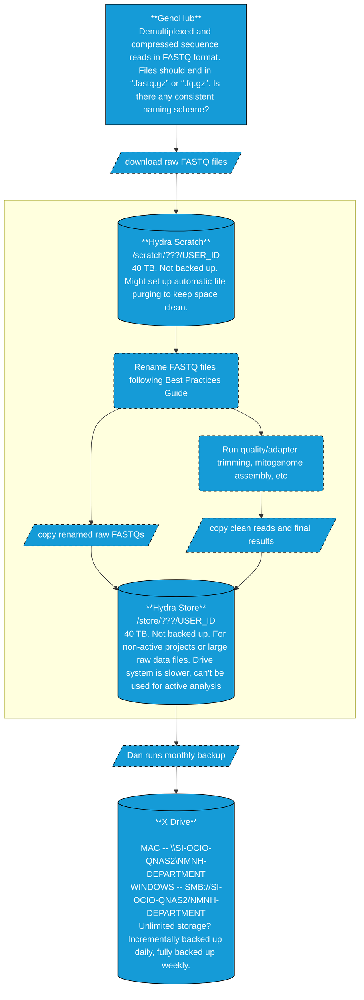

# SI-Ocean-DNA
Smithsonian NMNH Ocean DNA - data management and analysis

## Sequence Data File Names -- Best Practices Guide

Required fields:
- Voucher/Catalog ID
- Taxonomic ID (Family-Genus-Species?)
- anything else?

NO SPACES in file name

Use delimiter (underscore? period? dash?) to seperate fields in the file name. Delimiter must NOT be used within the fields.

## Data Management Guide

