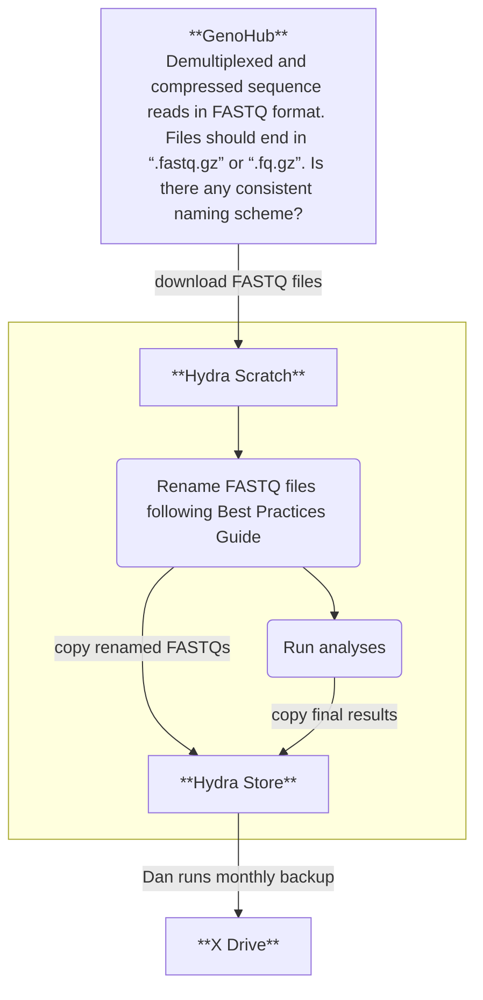

# SI-Ocean-DNA
Smithsonian NMNH Ocean DNA - data management and analysis

## Data Management Guide

```mermaid
graph TD;

  GenoHub[**GenoHub**
Demultiplexed and compressed sequence reads in FASTQ format. Files should end in “.fastq.gz” or “.fq.gz”. Is there any consistent naming scheme?]
  Rename("`Rename FASTQ files following Best Practices Guide`")
  Analyses(Run analyses)
  Scratch[**Hydra Scratch**]
  Store[**Hydra Store**]
  XDrive[**X Drive**]

  GenoHub--download FASTQ files-->Scratch
  subgraph " "
    Scratch-->Rename
    Rename-->Analyses
    Rename--copy renamed FASTQs-->Store
    Analyses--copy final results-->Store
  end
  Store--Dan runs monthly backup-->XDrive

```
